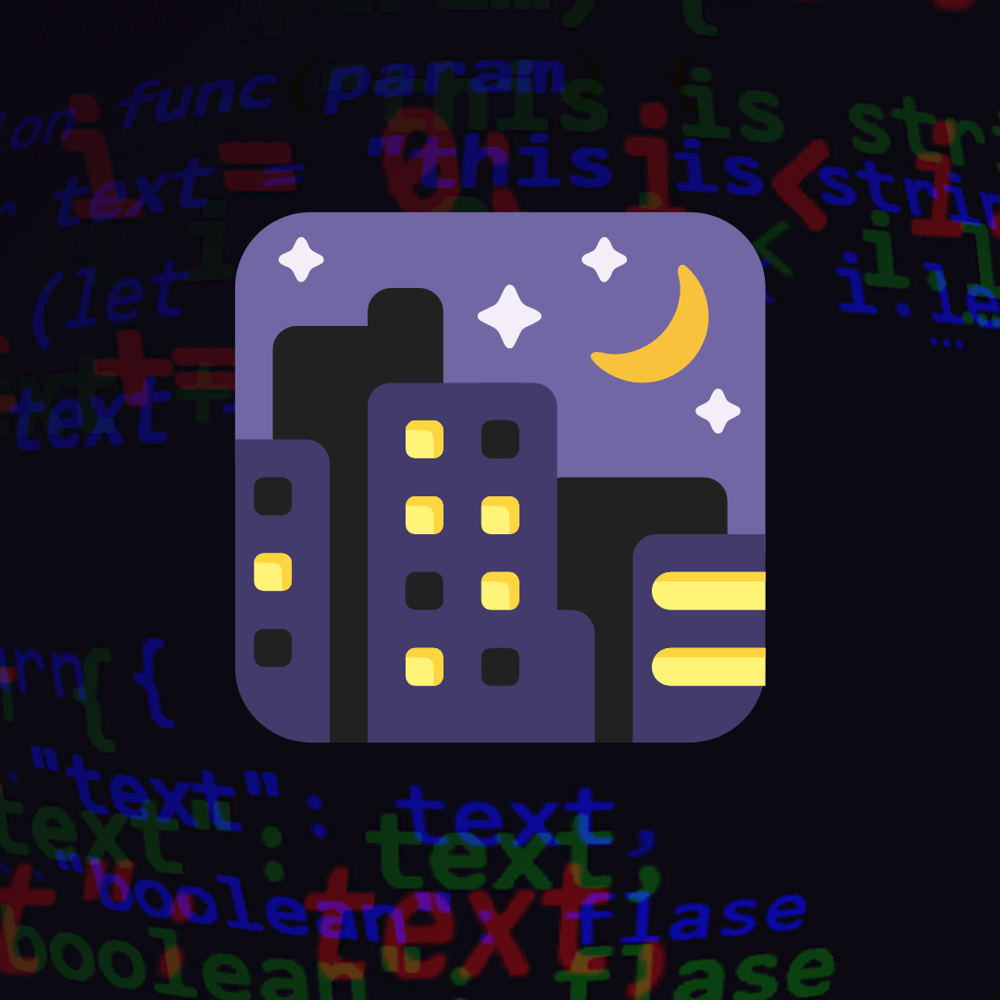

<div align="center">

</div>

# ShadowedNight Theme

ShadowedNight Theme is a Visual Studio Code (VS Code) theme extension designed to provide a clean, minimalistic, and pleasant coding experience. This theme is ideal for developers who want to focus on their code without being distracted by flashy and overly complicated syntax highlighting.

## Installation

You can install the ShadowedNight Theme extension through the VS Code Marketplace. Follow these steps to install the extension:

1. Open VS Code
2. Click on the Extensions icon on the left-hand side of the editor (or press `Ctrl+Shift+X`)
3. Search for "ShadowedNight"
4. Click the Install button

Alternatively, you can install the extension from the command line by running the following command:

```css
code --install-extension pritudev.shadowednight
```

## Activation

Once installed, you can activate the ShadowedNight Theme by following these steps:

1. Open VS Code
2. Click on the gear icon on the bottom left corner of the editor (or press `Ctrl+,`)
3. Click on "Color Theme"
4. Select "ShadowedNight" from the list

## Features

ShadowedNight Theme comes with the following features:

- Clean and minimalistic syntax highlighting
- Easy-to-read text
- High contrast for better visibility
- Support for various programming languages and file types
- Customizable settings for font size, line height, and more

## Customization

You can customize the ShadowedNight Theme by modifying the VS Code settings. Follow these steps to customize the theme:

1. Open VS Code
2. Click on the gear icon on the bottom left corner of the editor (or press `Ctrl+,`)
3. Click on "Settings"
4. Search for "ShadowedNight"
5. Modify the settings as desired

## Feedback and Contributions

If you have any feedback or suggestions for the ShadowedNight Theme, feel free to submit an issue or pull request on the GitHub repository. We welcome contributions from the community and are happy to collaborate with other developers to make this theme even better.

## License

The ShadowedNight Theme extension is licensed under the [MIT License](https://github.com/preetsuthar17/pritu-dark-them/blob)
